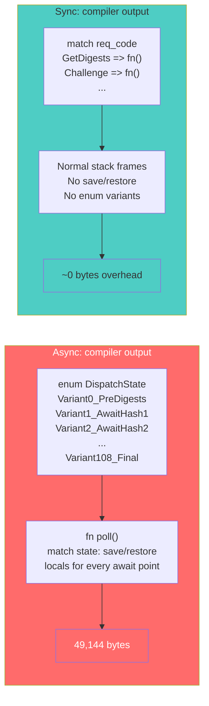
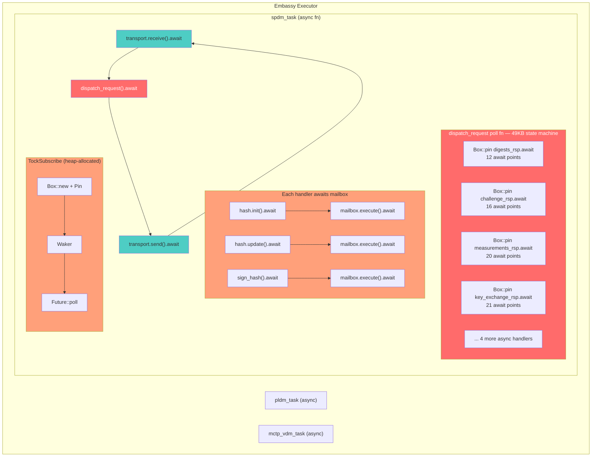
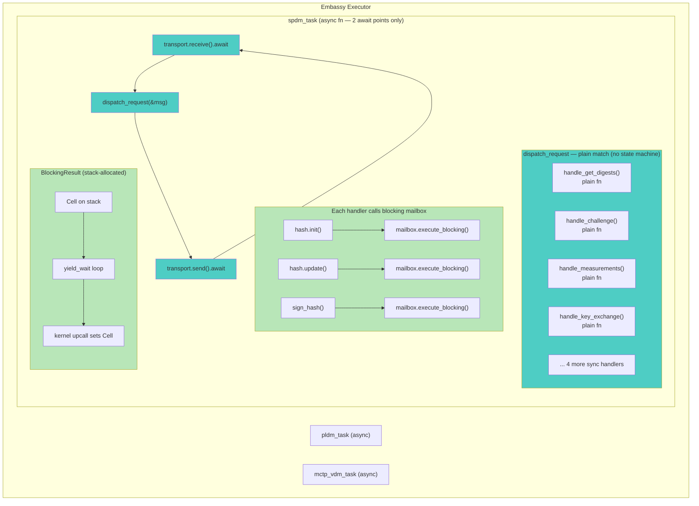
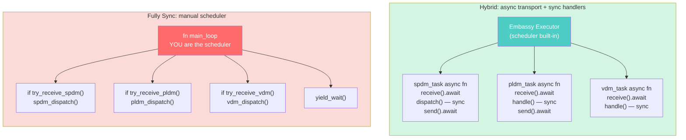

# Hybrid Architecture: Async Transport + Sync Handlers

## Summary

Converting SPDM command handlers from `async fn` to plain `fn` while keeping
transport (MCTP receive/send) async eliminates **57KB of flash** with zero
behavioral trade-offs and better maintainability than a fully sync alternative.

## Code Size Results

| Configuration | .text | .rodata | .data | .bss | Flash |
|---|---|---|---|---|---|
| **Original** (fully async) | 132,858 | 18,040 | 60 | 48,944 | 150,958 |
| **Hybrid** (async transport + sync handlers) | 83,040 | 10,884 | 32 | 31,960 | 93,956 |
| **Fully sync** (reference) | 83,040 | 10,884 | 32 | 31,960 | 93,956 |
| **Savings vs. original** | -49,818 | -7,156 | -28 | -16,984 | **-57,002 (-37.8%)** |

The hybrid and fully sync architectures produce **identical binaries** — the async
transport shell (embassy executor, 2 await points per task) adds no measurable overhead.

## The Problem: Async State Machines in Handlers

The root cause of the 57KB bloat is a single compiler-generated function:

```
dispatch_request poll fn: 49,144 bytes (.text) — 37% of total
```

This function is the async state machine for `dispatch_request`, which dispatches
to 8 SPDM command handlers. Each handler is an `async fn` with 12–21 await points
(crypto hashes, signatures, DPE commands — all Caliptra mailbox round-trips). The
compiler generates an enum variant for every suspend point, with save/restore code
for all live locals across each `.await`.



## The Insight: Two Categories of I/O

| Category | Examples | Latency | Concurrent work possible? | Right model |
|---|---|---|---|---|
| **Transport** | MCTP receive/send | ms–seconds | Yes (other tasks can run) | **Async** |
| **Crypto/mailbox** | hash, sign, DPE | microseconds | No | **Sync (blocking)** |

Transport operations are the *only* points where the MCU has nothing to do but wait
for an external event. While waiting, other embassy tasks (PLDM, MCTP-VDM) can run.

Every await point inside the handlers is a Caliptra mailbox round-trip that completes
in microseconds with no useful work to interleave. These are **blocking operations
dressed up as async** — the `async` keyword adds 49KB of state machine overhead for
zero benefit.

Critically, there is **no behavioral difference**: in the async model,
`mailbox.execute().await` calls `yield_wait` internally via the Tock executor's poll
loop. The single-threaded executor cannot run other tasks while polling a future —
other tasks only run when the *outermost* `.await` (transport) yields back to the
executor. Both models block identically on mailbox I/O.

## Architecture: Before and After

### Before: Fully Async



### After: Hybrid (async transport + sync handlers)



The blocking mailbox uses a stack-allocated `Cell` + `yield_wait` loop instead of
`TockSubscribe` (which requires `Box::new`, `Pin`, `Waker`, `Future` trait impl).
This is safe because Tock userspace is single-threaded and cooperative.

## Hybrid vs. Fully Sync

The hybrid and fully sync models produce identical handler code (40+ files, all SPDM
commands, crypto, certs, transcripts — plain `fn`, no `.await`). The only difference
is at the task boundary (2–3 files):

### Task-level architecture



### Code comparison

```rust
// ── HYBRID MODEL (current) ──────────────────────────────
// Each task is self-contained — embassy handles multiplexing

#[embassy_executor::task]
async fn spdm_task() {
    loop {
        let msg = transport.receive().await;  // yield to other tasks
        dispatch_request(&msg);                // sync handlers (plain fn)
        transport.send(&resp).await;           // yield to other tasks
    }
}

#[embassy_executor::task]
async fn pldm_task() { /* same pattern — isolated, independent */ }

#[embassy_executor::task]
async fn vdm_task()  { /* same pattern — isolated, independent */ }


// ── FULLY SYNC MODEL ────────────────────────────────────
// One big loop — you manually interleave all subsystems

fn main_loop() {
    loop {
        // Manual round-robin polling — you are the scheduler
        if let Some(msg) = mctp.try_receive_spdm() {
            spdm_dispatch(&msg);
            mctp.send_spdm(&resp);
        }
        if let Some(msg) = mctp.try_receive_pldm() {
            pldm_dispatch(&msg);
        }
        if let Some(cmd) = mcu_mbox.try_receive() {
            vdm_dispatch(&cmd);
        }
        yield_wait();  // back to kernel
    }
}
```

### Maintenance comparison

| Aspect | Hybrid (async transport) | Fully sync |
|---|---|---|
| **Handler code** | Plain `fn` — identical | Plain `fn` — identical |
| **Binary size** | Identical | Identical |
| **Adding a new task** | Add one `#[embassy_executor::task] async fn` | Modify `main_loop`, add polling branch, manage ordering |
| **Task isolation** | Complete — tasks can't interfere | Coupled — all in one loop, shared control flow |
| **Scheduling bugs** | Impossible — embassy handles it | Possible — wrong poll order, starvation, forgotten yield |
| **Testing tasks** | Each task testable in isolation | Must test the whole loop |
| **Code size overhead** | ~1–2KB (executor + 2 awaits/task) | 0 (but manual scheduler code offsets this) |
| **Upstream Tock ecosystem** | Aligned — embassy is the standard | Non-standard — custom scheduler |

### Verdict

The hybrid model is strictly better: identical binary size, identical handler code,
but with task isolation, no scheduling bugs, isolated testability, and upstream
alignment — for ~1–2KB of overhead that manual scheduler code would offset anyway.

---

## Testing: Concurrent Task Execution

The cooperative poll loop is validated by `test_cooperative_poll_loop_mbox` in
`tests/integration/src/runtime/test_mcu_mailbox.rs`. The test boots the emulator
with both SPDM and MCU Mbox active, then sends three sequential mbox commands
(`FirmwareVersion`, `GetAuthCmdChallenge`, `FirmwareVersion`) — proving the
cooperative loop successfully re-arms and processes requests while SPDM is
concurrently polling.

```bash
cargo test -p caliptra-mcu-tests-integration test_cooperative_poll_loop_mbox -- --nocapture
```

UART output confirms both services initialize and run:

```
MCU_MBOX: polling initialized
SPDM_TASK: Running SPDM-TASK (cooperative)...
```

---

## Guidelines: Structuring Async Code to Minimize Overhead

The experiments reveal three primary factors that drive async state machine bloat.
These guidelines apply to any `async fn` targeting constrained flash budgets.

### Factor 1: Number of await points per function

Each `.await` in an `async fn` creates a new enum variant in the compiler-generated
state machine. Every variant must save/restore all live locals across the suspend
point. More awaits = more variants = more code.

**Rule: Keep await counts low in any single `async fn`.**

```rust
// BAD — 15 await points in one function → 15 enum variants
async fn handle_challenge(ctx: &mut Ctx) {
    let hash = ctx.hash_init().await;
    ctx.hash_update(&header).await;
    ctx.hash_update(&ct_exponent).await;
    ctx.hash_update(&salt).await;
    // ... 11 more awaits
    ctx.sign_hash(&digest).await;
}

// GOOD — 0 await points (sync handler, blocking calls)
fn handle_challenge(ctx: &mut Ctx) {
    let hash = ctx.hash_init();       // blocks via yield_wait
    ctx.hash_update(&header);
    ctx.hash_update(&ct_exponent);
    ctx.hash_update(&salt);
    // ... same operations, zero state machine overhead
    ctx.sign_hash(&digest);
}
```

### Factor 2: Grouping — dispatching through a single async fn

When a single `async fn` calls multiple other `async fn`s (e.g. via match), the
compiler merges all sub-futures' states into one giant enum. This is the
`dispatch_request` problem: 8 handlers × 12–21 awaits each = 108+ variants in one
poll function.

**Rule: Never fan-out to multiple async handlers from a single async dispatch fn.**

```rust
// BAD — one poll fn contains states for ALL 8 handlers = 49KB
async fn dispatch_request(code: u8, ctx: &mut Ctx) {
    match code {
        0x01 => get_digests(ctx).await,     // 12 awaits
        0x02 => challenge(ctx).await,       // 16 awaits
        0x03 => measurements(ctx).await,    // 20 awaits
        0x04 => key_exchange(ctx).await,    // 21 awaits
        // ... 4 more
    }
}

// GOOD — dispatch is sync, no state machine at all
fn dispatch_request(code: u8, ctx: &mut Ctx) {
    match code {
        0x01 => get_digests(ctx),           // sync fn
        0x02 => challenge(ctx),             // sync fn
        0x03 => measurements(ctx),          // sync fn
        0x04 => key_exchange(ctx),          // sync fn
        // each handler's stack frame is independent
    }
}
```

### Factor 3: Await chain depth

Deeply nested async call chains compound the problem. An `async fn` that awaits
another `async fn` that awaits another creates nested state machines that the
compiler must compose. Each level adds its own enum variants and save/restore code.

**Rule: Keep async at the task boundary (outermost level). Push sync down.**

```rust
// BAD — 3 levels deep, each level adds state machine overhead
async fn task() {
    handle_request().await;   // level 1
}
async fn handle_request() {
    do_crypto().await;        // level 2
}
async fn do_crypto() {
    mailbox.execute().await;  // level 3
}

// GOOD — async only at top, sync everywhere else
async fn task() {
    let msg = transport.receive().await;  // async: yields to other tasks
    handle_request(&msg);                 // sync: no state machine
    transport.send(&resp).await;          // async: yields to other tasks
}
fn handle_request(msg: &[u8]) {
    do_crypto();                          // sync
}
fn do_crypto() {
    mailbox.execute_blocking();           // sync: yield_wait loop
}
```

### Decision framework

```
Is this an I/O operation where other tasks should run while we wait?
├── YES (transport receive/send, long external waits) → async fn + .await
└── NO  (mailbox round-trip, crypto, internal operations)
    ├── Single-threaded executor? → sync fn + blocking
    └── Multi-threaded runtime?   → async may be justified
```

### Summary of cost model

| Pattern | State machine cost | Recommendation |
|---|---|---|
| `async fn` with 1–2 awaits (task boundary) | ~0 measurable | Use freely |
| `async fn` with 10+ awaits (handler) | ~3–5KB per handler | Convert to sync |
| Async dispatch to N async handlers | N × per-handler cost (compounds) | Dispatch must be sync |
| Deep async call chain (3+ levels) | Multiplicative nesting | Flatten to sync |

---

## Appendix: Optimization Experiments

Before arriving at the hybrid architecture, we tested whether async code size could
be reduced through structural optimizations alone (without removing `async` from
handlers). None succeeded.

### 1. `#[inline(always)]` on `dispatch_request`
- **Result**: No change — LTO already inlines everything

### 2. `#[inline(never)]` on `dispatch_request`
- **Result**: +84 bytes — LTO ignores this hint for async poll functions

### 3. Remove `Box::pin` (inline futures directly in dispatch)
- **Result**: .text +2,046, .bss +11,096
- Box::pin was actually *helping* reduce BSS (task POOL size)

### 4. `dyn Future` (dynamic dispatch to prevent LTO inlining)
- **Result**: .text +518, .rodata +92
- Handler code still exists as separate functions; total unchanged
- vtable overhead slightly increases size

### 5. Remove 2 largest handlers (measurements_rsp + key_exchange_rsp)
- **Result**: .text -28,008 — confirms per-handler state machine cost

### 6. Remove ALL 8 async handlers (stubs only)
- **Result**: .text drops to 44,642 (-88,216)
- `dispatch_request` poll function vanishes entirely
- Proves async overhead is ~49KB (88K handler total − 39K actual code)

### Conclusion from experiments

Async state machine overhead is **fundamental to how `async fn` compiles** — each
await point creates enum variants with save/restore code. No compiler hint, dispatch
strategy, or boxing approach can eliminate this. The only solution is to remove
`async` from functions where it provides no behavioral benefit.
