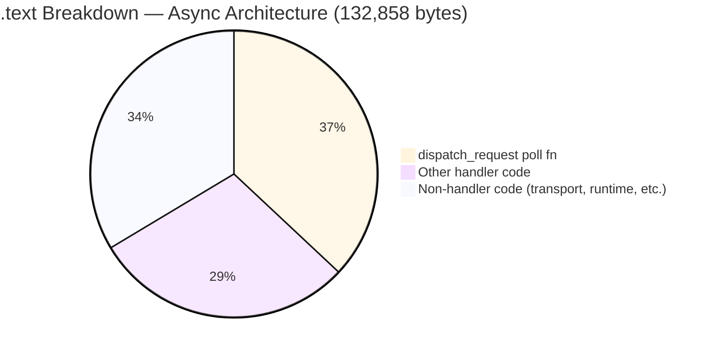
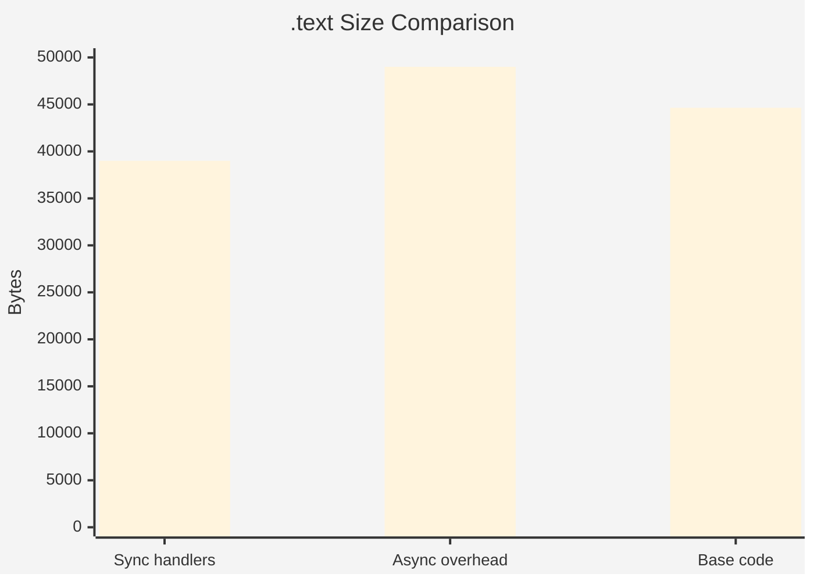
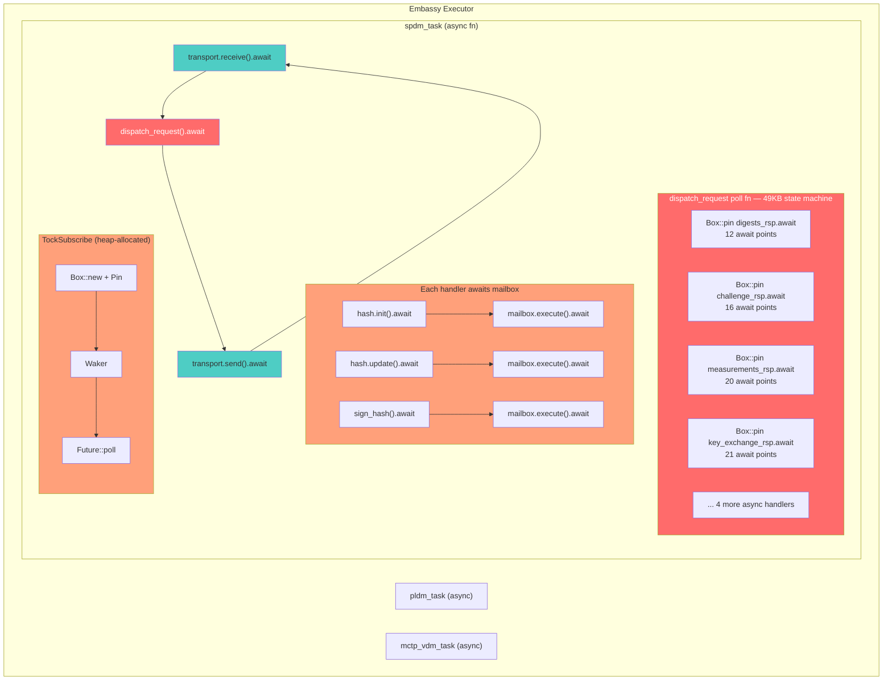
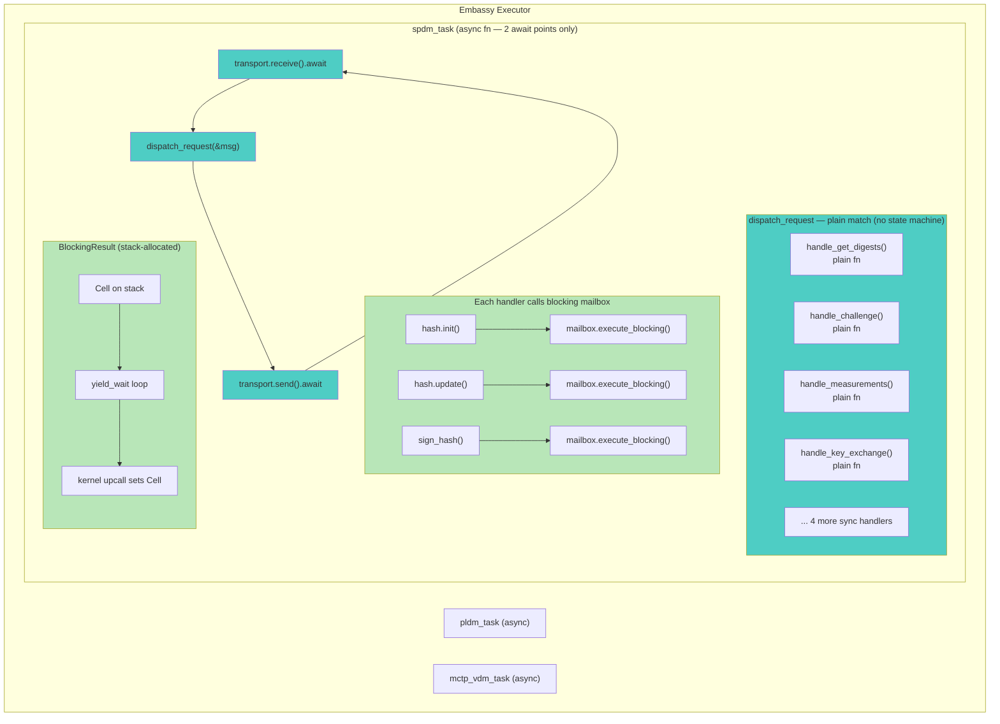
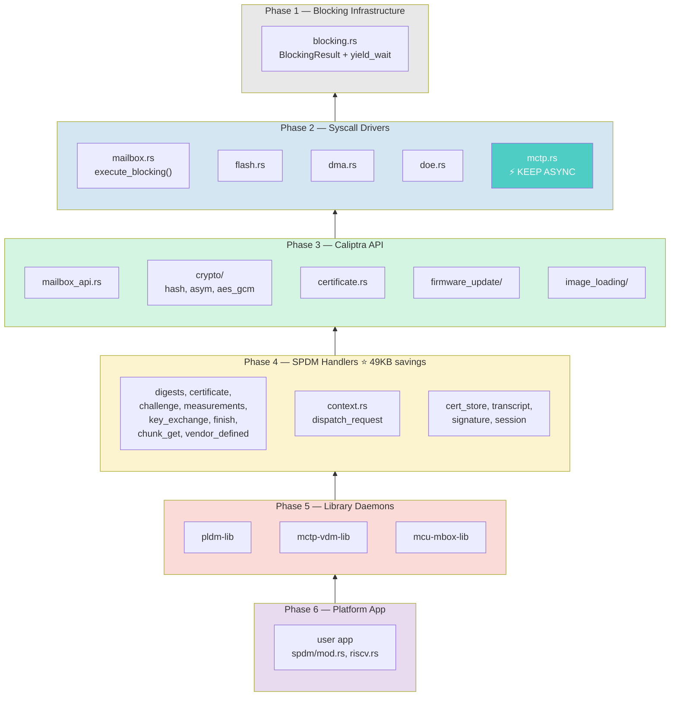
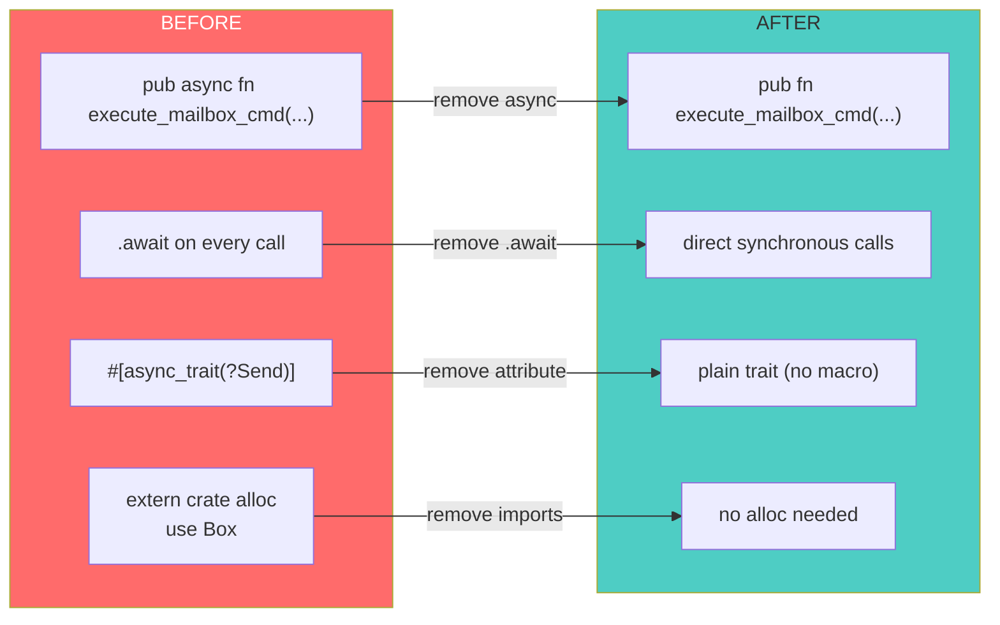

# Async Code Size Experiment Results

## Objective

Determine whether async Rust code size can be made competitive with sync through
structural optimizations, without converting handlers from async to sync.

## Baseline Measurements

| Configuration | .text | .rodata | .bss | Flash (.text+.rodata+.data) |
|---|---|---|---|---|
| **Sync branch** (dev/atul/sync_conversion) | 83,040 | 10,884 | 31,960 | 93,956 |
| **Async optimized** (dev/atul/async_opt) | 132,858 | 18,040 | 48,944 | 150,958 |
| **Gap** | +49,818 | +7,156 | +16,984 | +57,002 |

## Key Finding: The `dispatch_request` State Machine

The single largest symbol in the async binary:

```
dispatch_request poll fn: 49,144 bytes (.text)
```

This ONE function is 37% of total .text and accounts for virtually the entire
sync-vs-async .text gap (49,818 bytes). It contains all 8 handler poll functions
inlined by LTO.

## Experiments Tried

### 1. `#[inline(always)]` on dispatch_request
- **Result**: No change (LTO already inlines)

### 2. `#[inline(never)]` on dispatch_request
- **Result**: +84 bytes (LTO ignores it for async poll fns)

### 3. Remove `Box::pin` (inline futures directly)
- **Result**: .text +2,046, .bss +11,096
- Box::pin was actually helping reduce BSS (task POOL size)
- Confirms Box::pin is the right choice for the current async architecture

### 4. `dyn Future` (dynamic dispatch to prevent inlining)
- **Result**: .text +518, .rodata +92
- Handler code still exists as separate functions, total size unchanged
- vtable overhead slightly increases size

### 5. Remove measurements_rsp + key_exchange_rsp handlers (2 largest, 20+ await points each)
- **Result**: .text -28,008 (104,850), dispatch poll fn: 33,534 (from 49,144)
- Two handlers alone contribute 28KB

### 6. Remove ALL 8 async handlers (stubs only)
- **Result**: .text 44,642 (-88,216), .rodata 9,412, .bss 45,768
- dispatch_request poll fn vanishes entirely (no await points = no state machine)

## Analysis





The async state machine overhead is:
- **49KB of .text** — entirely from state machine poll code
- **~3KB of .bss** — task POOL size increase
- **~7KB of .rodata** — state transition tables, vtables

### Why structural optimizations can't fix this:

1. **LTO inlines everything**: Regardless of Box::pin, inline attributes, or dyn dispatch,
   the state machine code exists somewhere. LTO either inlines it (49KB monolith) or
   keeps it separate (same total code, slightly more overhead from vtables).

2. **State machines are inherently larger**: Each await point creates enum variants,
   save/restore code for all live locals, and poll/match logic. This 2-3x size
   multiplier is fundamental to how `async fn` compiles.

3. **No middle ground**: You either have the state machine (full async overhead) or
   you don't (sync code). There's no way to get "partial" savings without actually
   removing await points.

## Architectural Insight: Async Belongs at the Task Boundary

The experiment reveals a clear principle: **async is the right model for transport
(waiting for network packets), but the wrong model for handler internals (sequential
mailbox round-trips).**

### Two categories of I/O in this system

| Category | Examples | Latency | Concurrent work? | Right model |
|---|---|---|---|---|
| **Transport** | MCTP receive/send | ms–seconds | Yes (other tasks) | **Async** |
| **Crypto/mailbox** | hash, sign, DPE | microseconds | No | **Sync (blocking)** |

Transport operations (MCTP packet receive/send) are the *only* points where the MCU
legitimately has nothing to do but wait for an external event. While waiting, other
embassy tasks (PLDM, MCTP-VDM) can productively run. Async is correct here.

Every await point inside the handlers is a Caliptra mailbox round-trip — these complete
in microseconds, there's no useful work to interleave, and the handler cannot make
progress until the result returns. These are **blocking operations dressed up as async**.
The `async` keyword buys nothing except 49KB of state machine overhead.

### Before: Fully Async Architecture



### After: Hybrid Architecture (async transport + sync handlers)



The blocking mailbox uses a stack-allocated `Cell` + `yield_wait` loop instead of
`TockSubscribe` (which requires `Box::new`, `Pin`, `Waker`, `Future` trait impl).
This is safe because Tock userspace is single-threaded and cooperative — `yield_wait`
returns to the kernel, which fires the upcall setting the Cell, and the loop reads it.

### Why this eliminates 49KB


The 49KB `dispatch_request` poll function exists because each of the 8 handlers is an
`async fn` with 12–21 await points. The compiler generates an enum variant for every
suspend point, with save/restore code for all live locals. With sync handlers, dispatch
is a plain `match` calling regular functions — zero state machines, zero save/restore,
zero poll/match logic. The compiler uses normal stack frames instead.

### Trade-off: None

There is no behavioral difference. In the async model, `mailbox.execute().await` calls
`yield_wait` internally via the Tock executor's poll loop — the single-threaded executor
cannot run other embassy tasks while the current task's future is being polled. Other
tasks only get a chance to run when the *outermost* `.await` (transport receive/send)
yields back to the executor.

Since mailbox operations complete in microseconds and the executor is single-threaded,
both models block identically on crypto/mailbox I/O. The only difference is whether the
compiler generates a 49KB state machine around those blocking points.

## Conclusion

**Async code size cannot be made competitive with sync through structural optimizations.**

The only way to eliminate the ~49KB overhead is to convert handlers from `async fn` to
regular `fn` while keeping transport async — the hybrid architecture.

### Estimated sizes with hybrid (async transport + sync handlers):
- .text: ~84,000 (44,642 base + ~39,000 sync handler code)
- This matches the sync branch's 83,040 almost exactly
- The async transport shell (embassy executor, TockSubscribe) adds minimal overhead (~1–2KB)

---

## Implementation Plan



### Phase 1: Blocking Infrastructure (Layer 0)

Add the blocking syscall primitives that replace `TockSubscribe` for handler-internal I/O.

**Files to create:**
- `runtime/userspace/libtockasync/src/blocking.rs` — `BlockingResult` struct (stack Cell),
  `blocking_upcall` (extern "C"), `wait_for_result` (yield_wait loop),
  `subscribe_allow_ro_rw_and_wait`, `subscribe_allow_rw_and_wait`,
  `subscribe_allow_ro_and_wait`, `subscribe_and_wait`

**Files to modify:**
- `runtime/userspace/libtockasync/src/lib.rs` — export `pub mod blocking`
- `runtime/userspace/libtockasync/Cargo.toml` — remove `embassy-sync` dependency
  (no longer needed once Mutex is replaced)

### Phase 2: Syscall Drivers (Layer 1)

Convert all kernel-facing drivers from async to sync using the blocking primitives.

**Files to modify:**
| File | Change |
|---|---|
| `runtime/userspace/syscall/src/mailbox.rs` | `execute()` / `execute_with_payload_stream()`: async→sync, replace TockSubscribe with `blocking::subscribe_allow_ro_rw_and_wait`, remove `MAILBOX_MUTEX` (single-threaded, no contention without async) |
| `runtime/userspace/syscall/src/flash.rs` | `write()`/`read()`/`erase()`: async→sync |
| `runtime/userspace/syscall/src/dma.rs` | DMA ops: async→sync |
| `runtime/userspace/syscall/src/doe.rs` | DOE ops: async→sync |
| `runtime/userspace/syscall/src/mctp.rs` | **Keep async** — this is transport (genuine wait-for-packet) |
| `runtime/userspace/syscall/src/mcu_mbox.rs` | async→sync |
| `runtime/userspace/syscall/src/mbox_sram.rs` | async→sync |
| `runtime/userspace/syscall/src/logging.rs` | async→sync |
| `runtime/userspace/syscall/Cargo.toml` | Remove `embassy-sync`, `async-trait` deps if no longer needed |

### Phase 3: Caliptra API Layer (Layer 2)

Convert the middleware that wraps mailbox commands into typed crypto/cert operations.

**Files to modify:**
| File | Change |
|---|---|
| `runtime/userspace/api/caliptra-api/src/mailbox_api.rs` | `execute_mailbox_cmd()`: async→sync |
| `runtime/userspace/api/caliptra-api/src/crypto/hash.rs` | `init()`/`update()`/`finalize()`: async→sync |
| `runtime/userspace/api/caliptra-api/src/crypto/asym.rs` | Signing ops: async→sync |
| `runtime/userspace/api/caliptra-api/src/crypto/aes_gcm.rs` | AES-GCM ops: async→sync |
| `runtime/userspace/api/caliptra-api/src/certificate.rs` | DPE cert ops: async→sync |
| `runtime/userspace/api/caliptra-api/src/error.rs` | Remove async-related error variants if any |
| `runtime/userspace/api/caliptra-api/src/firmware_update/*.rs` | async→sync (4 files) |
| `runtime/userspace/api/caliptra-api/src/image_loading/*.rs` | async→sync (4 files) |
| `runtime/userspace/api/caliptra-api/Cargo.toml` | Remove `async-trait` dep |

### Phase 4: SPDM Handlers (Layer 3) — The Big Win

Convert all 8 async command handlers to plain `fn`. This is where the 49KB savings come from.

**Files to modify (in `runtime/userspace/api/spdm-lib/src/`):**
| File | Await points removed |
|---|---|
| `commands/digests_rsp.rs` | 12 |
| `commands/certificate_rsp.rs` | 13 |
| `commands/challenge_auth_rsp.rs` | 16 |
| `commands/finish_rsp.rs` | 14 |
| `commands/key_exchange_rsp.rs` | 21 |
| `commands/measurements_rsp.rs` | 20 |
| `commands/chunk_get_rsp.rs` | ~8 |
| `commands/vendor_defined_rsp.rs` | ~5 |
| `context.rs` | `dispatch_request`: async→sync (remove all Box::pin), `send_response`/`handle_request`: keep async (transport) |
| `cert_store.rs` | Hash operations: async→sync |
| `protocol/signature.rs` | Sign/verify: async→sync |
| `session/*.rs` | Session crypto (HMAC, AEAD): async→sync |
| `transcript.rs` | Transcript hashing: async→sync |
| `measurements.rs` | Measurement fetching: async→sync |
| `transport/mctp.rs` | **Keep async** — transport layer |
| `vdm_handler/**/*.rs` | Remove `#[async_trait]`, convert to sync (~6 files) |
| `Cargo.toml` | Remove `async-trait` dep |

### Phase 5: Library Daemons & Transport (Layer 4)

Convert library-level daemons while keeping transport async.

**Files to modify:**
| File | Change |
|---|---|
| `runtime/userspace/api/pldm-lib/src/*.rs` | `cmd_interface`, `transport`, `timer`, `fd_ops`: async→sync for handler logic, keep transport async |
| `runtime/userspace/api/mctp-vdm-lib/src/*.rs` | Same pattern |
| `runtime/userspace/api/mcu-mbox-lib/src/*.rs` | Same pattern |
| `runtime/userspace/api/caliptra-common-commands/src/lib.rs` | Remove `#[async_trait]` from 2 trait defs |

### Phase 6: Platform App Integration (Layer 5)

Wire up the emulator app to use sync handlers with async task shell.

**Files to modify:**
| File | Change |
|---|---|
| `platforms/emulator/.../apps/user/src/spdm/mod.rs` | Task stays async, handler calls become sync |
| `platforms/emulator/.../apps/user/src/spdm/device_cert_store.rs` | Cert store impl: async→sync |
| `platforms/emulator/.../apps/user/src/spdm/cert_store/cert_chain/leaf.rs` | Leaf cert: async→sync |
| `platforms/emulator/.../apps/user/src/spdm/shared_large_msg_buf.rs` | Shared buf: async→sync |
| `platforms/emulator/.../apps/user/src/vdm/mod.rs` | VDM handler: async→sync |
| `platforms/emulator/.../apps/user/src/firmware_update/mod.rs` | FW update: async→sync |
| `platforms/emulator/.../apps/user/src/image_loader/*.rs` | Image loader: async→sync |
| `platforms/emulator/.../apps/user/src/riscv.rs` | Main task wiring |
| Various `Cargo.toml` files | Remove `async-trait`, `embassy-sync` deps |

### Phase 7: Validation

1. Build for riscv32imc-unknown-none-elf and verify flash size ≤ 98,304 bytes
2. Run integration tests (`tests/integration/`)
3. Verify SPDM responder functional correctness
4. Compare section sizes against sync branch expectations

### Conversion Pattern (mechanical per-function)



```rust
// BEFORE (async)
pub async fn execute_mailbox_cmd(
    mailbox: &Mailbox, cmd: u32, req: &mut [u8], resp: &mut [u8],
) -> Result<usize> {
    mailbox.execute(cmd, req, resp).await
}

// AFTER (sync)
pub fn execute_mailbox_cmd(
    mailbox: &Mailbox, cmd: u32, req: &mut [u8], resp: &mut [u8],
) -> Result<usize> {
    mailbox.execute(cmd, req, resp)
}
```

For traits: remove `#[async_trait(?Send)]`, `async` from methods, `.await` from calls,
and `extern crate alloc` / `Box` imports that async_trait required.

### Estimated effort

~50 files, ~200 mechanical edits (remove `async`, `.await`, `#[async_trait]`).
The changes are **bottom-up**: each layer can be converted and tested independently.
Phase 1–2 can be validated by building just the syscall crate. Phase 3–4 is the
bulk of the work and the source of nearly all size savings.
