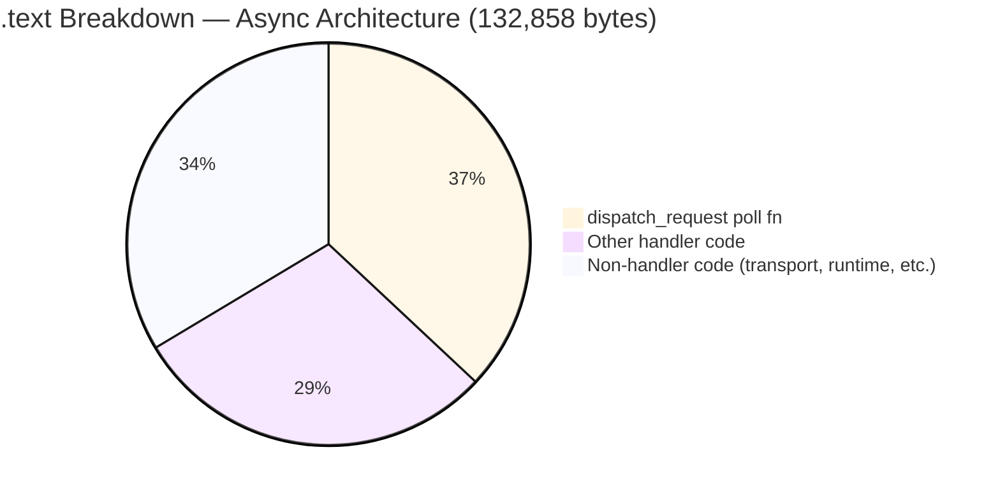
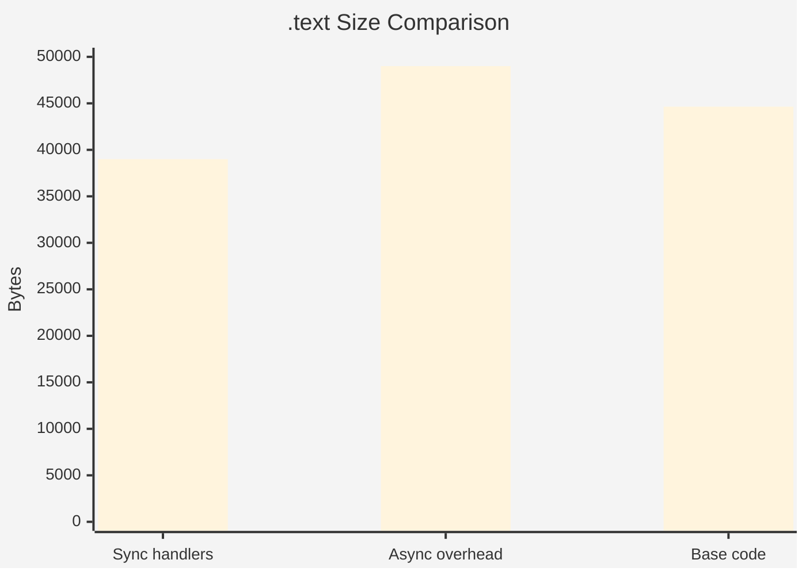
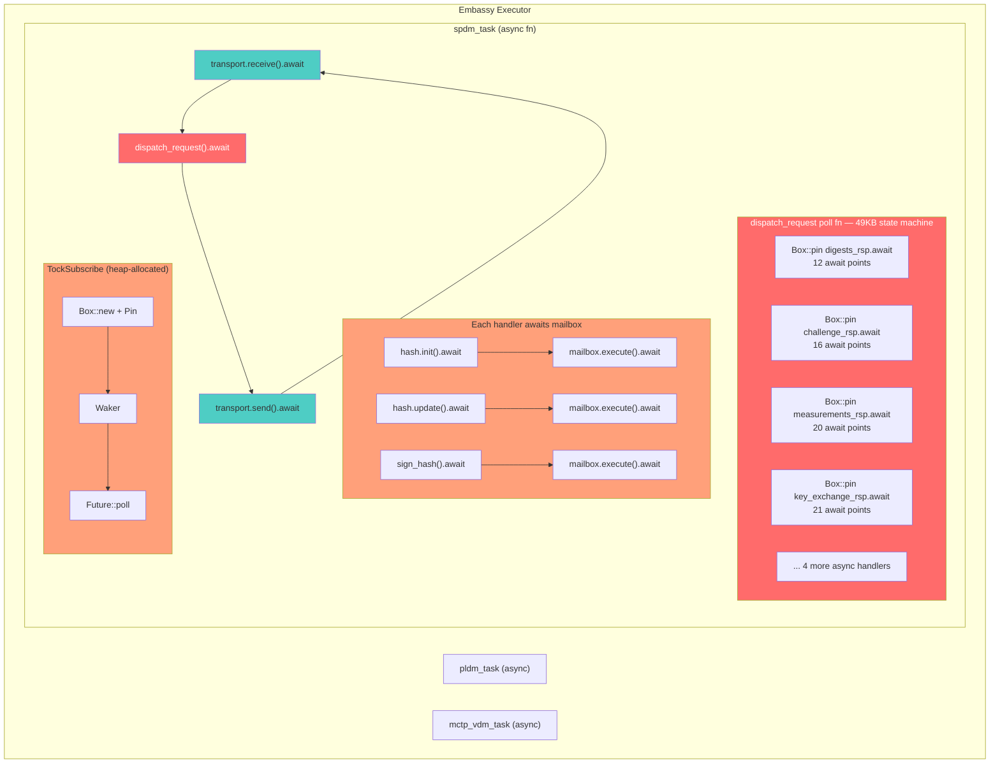
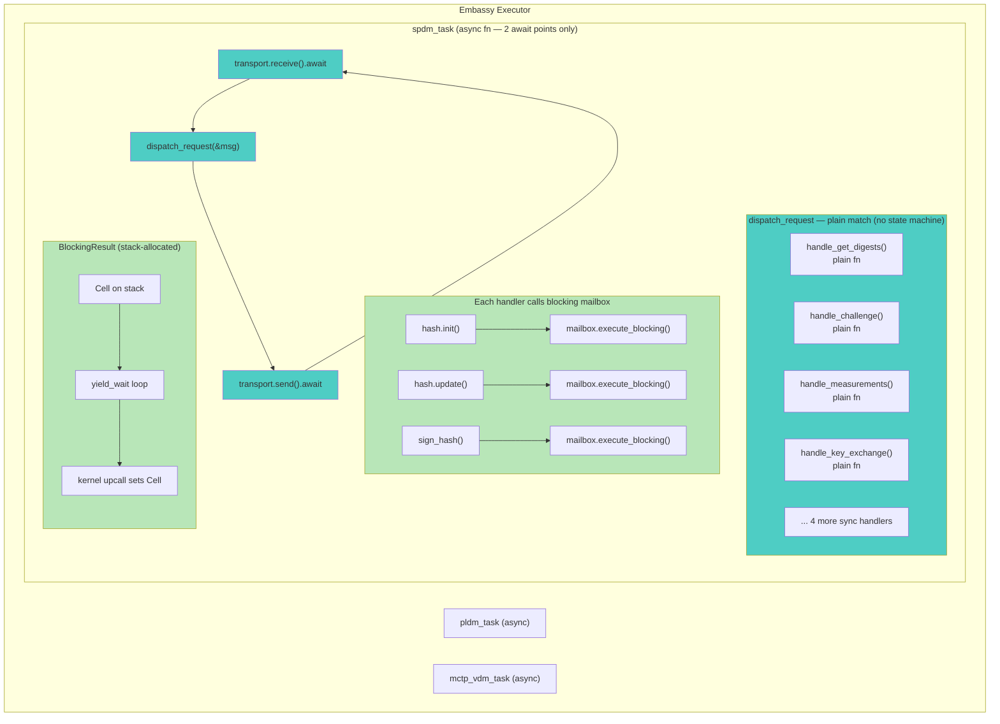
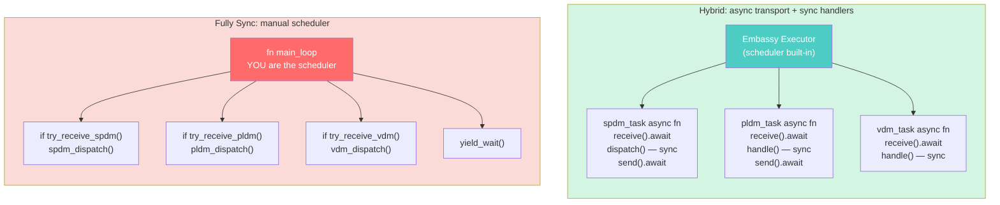

# Async Code Size Experiment Results

## Objective

Determine whether async Rust code size can be made competitive with sync through
structural optimizations, without converting handlers from async to sync.

## Baseline Measurements

| Configuration | .text | .rodata | .bss | Flash (.text+.rodata+.data) |
|---|---|---|---|---|
| **Sync branch** (dev/atul/sync_conversion) | 83,040 | 10,884 | 31,960 | 93,956 |
| **Async optimized** (dev/atul/async_opt) | 132,858 | 18,040 | 48,944 | 150,958 |
| **Gap** | +49,818 | +7,156 | +16,984 | +57,002 |

## Key Finding: The `dispatch_request` State Machine

The single largest symbol in the async binary:

```
dispatch_request poll fn: 49,144 bytes (.text)
```

This ONE function is 37% of total .text and accounts for virtually the entire
sync-vs-async .text gap (49,818 bytes). It contains all 8 handler poll functions
inlined by LTO.

## Experiments Tried

### 1. `#[inline(always)]` on dispatch_request
- **Result**: No change (LTO already inlines)

### 2. `#[inline(never)]` on dispatch_request
- **Result**: +84 bytes (LTO ignores it for async poll fns)

### 3. Remove `Box::pin` (inline futures directly)
- **Result**: .text +2,046, .bss +11,096
- Box::pin was actually helping reduce BSS (task POOL size)
- Confirms Box::pin is the right choice for the current async architecture

### 4. `dyn Future` (dynamic dispatch to prevent inlining)
- **Result**: .text +518, .rodata +92
- Handler code still exists as separate functions, total size unchanged
- vtable overhead slightly increases size

### 5. Remove measurements_rsp + key_exchange_rsp handlers (2 largest, 20+ await points each)
- **Result**: .text -28,008 (104,850), dispatch poll fn: 33,534 (from 49,144)
- Two handlers alone contribute 28KB

### 6. Remove ALL 8 async handlers (stubs only)
- **Result**: .text 44,642 (-88,216), .rodata 9,412, .bss 45,768
- dispatch_request poll fn vanishes entirely (no await points = no state machine)

## Analysis





The async state machine overhead is:
- **49KB of .text** — entirely from state machine poll code
- **~3KB of .bss** — task POOL size increase
- **~7KB of .rodata** — state transition tables, vtables

### Why structural optimizations can't fix this:

1. **LTO inlines everything**: Regardless of Box::pin, inline attributes, or dyn dispatch,
   the state machine code exists somewhere. LTO either inlines it (49KB monolith) or
   keeps it separate (same total code, slightly more overhead from vtables).

2. **State machines are inherently larger**: Each await point creates enum variants,
   save/restore code for all live locals, and poll/match logic. This 2-3x size
   multiplier is fundamental to how `async fn` compiles.

3. **No middle ground**: You either have the state machine (full async overhead) or
   you don't (sync code). There's no way to get "partial" savings without actually
   removing await points.

## Architectural Insight: Async Belongs at the Task Boundary

The experiment reveals a clear principle: **async is the right model for transport
(waiting for network packets), but the wrong model for handler internals (sequential
mailbox round-trips).**

### Two categories of I/O in this system

| Category | Examples | Latency | Concurrent work? | Right model |
|---|---|---|---|---|
| **Transport** | MCTP receive/send | ms–seconds | Yes (other tasks) | **Async** |
| **Crypto/mailbox** | hash, sign, DPE | microseconds | No | **Sync (blocking)** |

Transport operations (MCTP packet receive/send) are the *only* points where the MCU
legitimately has nothing to do but wait for an external event. While waiting, other
embassy tasks (PLDM, MCTP-VDM) can productively run. Async is correct here.

Every await point inside the handlers is a Caliptra mailbox round-trip — these complete
in microseconds, there's no useful work to interleave, and the handler cannot make
progress until the result returns. These are **blocking operations dressed up as async**.
The `async` keyword buys nothing except 49KB of state machine overhead.

### Before: Fully Async Architecture



### After: Hybrid Architecture (async transport + sync handlers)



The blocking mailbox uses a stack-allocated `Cell` + `yield_wait` loop instead of
`TockSubscribe` (which requires `Box::new`, `Pin`, `Waker`, `Future` trait impl).
This is safe because Tock userspace is single-threaded and cooperative — `yield_wait`
returns to the kernel, which fires the upcall setting the Cell, and the loop reads it.

### Why this eliminates 49KB


The 49KB `dispatch_request` poll function exists because each of the 8 handlers is an
`async fn` with 12–21 await points. The compiler generates an enum variant for every
suspend point, with save/restore code for all live locals. With sync handlers, dispatch
is a plain `match` calling regular functions — zero state machines, zero save/restore,
zero poll/match logic. The compiler uses normal stack frames instead.

### Trade-off: None

There is no behavioral difference. In the async model, `mailbox.execute().await` calls
`yield_wait` internally via the Tock executor's poll loop — the single-threaded executor
cannot run other embassy tasks while the current task's future is being polled. Other
tasks only get a chance to run when the *outermost* `.await` (transport receive/send)
yields back to the executor.

Since mailbox operations complete in microseconds and the executor is single-threaded,
both models block identically on crypto/mailbox I/O. The only difference is whether the
compiler generates a 49KB state machine around those blocking points.

## Conclusion

**Async code size cannot be made competitive with sync through structural optimizations.**

The only way to eliminate the ~49KB overhead is to convert handlers from `async fn` to
regular `fn` while keeping transport async — the hybrid architecture.

### Estimated sizes with hybrid (async transport + sync handlers):
- .text: ~84,000 (44,642 base + ~39,000 sync handler code)
- This matches the sync branch's 83,040 almost exactly
- The async transport shell (embassy executor, TockSubscribe) adds minimal overhead (~1–2KB)

---

## Hybrid vs. Fully Sync: Ergonomics and Maintenance

### Task-level architecture comparison



### Code comparison

```rust
// ── HYBRID MODEL (current) ──────────────────────────────
// Each task is self-contained — embassy handles multiplexing

#[embassy_executor::task]
async fn spdm_task() {
    loop {
        let msg = transport.receive().await;  // yield to other tasks
        dispatch_request(&msg);                // sync handlers (plain fn)
        transport.send(&resp).await;           // yield to other tasks
    }
}

#[embassy_executor::task]
async fn pldm_task() { /* same pattern — isolated, independent */ }

#[embassy_executor::task]
async fn vdm_task()  { /* same pattern — isolated, independent */ }


// ── FULLY SYNC MODEL ────────────────────────────────────
// One big loop — you manually interleave all subsystems

fn main_loop() {
    loop {
        // Manual round-robin polling — you are the scheduler
        if let Some(msg) = mctp.try_receive_spdm() {
            spdm_dispatch(&msg);
            mctp.send_spdm(&resp);
        }
        if let Some(msg) = mctp.try_receive_pldm() {
            pldm_dispatch(&msg);
        }
        if let Some(cmd) = mcu_mbox.try_receive() {
            vdm_dispatch(&cmd);
        }
        yield_wait();  // back to kernel
    }
}
```

### Maintenance comparison

| Aspect | Hybrid (async transport) | Fully sync |
|---|---|---|
| **Handler code** | Plain `fn` — identical | Plain `fn` — identical |
| **Adding a new task** | Add one `#[embassy_executor::task] async fn` | Modify `main_loop`, add polling branch, manage ordering |
| **Task isolation** | Complete — tasks can't interfere | Coupled — all in one loop, shared control flow |
| **Scheduling bugs** | Impossible — embassy handles it | Possible — wrong poll order, starvation, forgotten yield |
| **Testing tasks** | Each task testable in isolation | Must test the whole loop |
| **Code size overhead** | ~1–2KB (executor + 2 awaits/task) | 0 (but manual scheduler code offsets this) |
| **Upstream Tock ecosystem** | Aligned — embassy is the standard | Non-standard — custom scheduler |

### Verdict: Hybrid is strictly better for maintenance

The handler code (40+ files, all SPDM commands, crypto, certs, transcripts) is
**identical** in both models — plain `fn`, no `.await`, same signatures. The only
difference is at the task boundary (2–3 files).

The hybrid model wins on maintenance because:
1. **Task isolation** — each subsystem is a self-contained loop. Adding SPDM-over-DOE
   meant adding one new `async fn`, not threading another branch into a monolithic loop.
2. **No scheduling bugs** — embassy guarantees fair round-robin. A fully sync loop
   requires manual discipline to avoid starvation (e.g., a long SPDM handler blocking
   PLDM polling).
3. **Upstream alignment** — embassy-executor is the standard Tock/embedded-Rust async
   runtime. Fully sync means maintaining a custom scheduler that future contributors
   must understand.
4. **Negligible cost** — async transport adds ~1–2KB vs. the manual scheduler code you'd
   write anyway. The 49KB savings come entirely from making *handlers* sync, which both
   models do.
