# Synchronous Architecture for the MCU User-App

## Overview

The `user-app` firmware runs on a single-threaded RISC-V 32-bit MCU
(`riscv32imc-unknown-none-elf`) under the Tock OS kernel. It implements
multiple security protocols — SPDM, PLDM, MCU Mailbox, and MCTP-VDM —
that must service incoming requests concurrently.

This document describes the fully synchronous architecture that replaced
the original Embassy-based async/await runtime. The conversion eliminated
Rust async state machines, the Embassy executor, and heap-allocated
futures, resulting in a 37% flash reduction while preserving concurrent
multi-service operation through a cooperative poll loop.

**Target:** `riscv32imc-unknown-none-elf` (RISC-V 32-bit, Tock OS)
**Toolchain:** Rust 1.85
**Build profile:** `opt-level = "z"`, `lto = true`, `codegen-units = 1`, `panic = "abort"`

---

## Binary Size Impact

All measurements use `size -A` (SysV format) against the default-features
`user-app` binary. The "Before" column is the original Embassy-based async
build; the "After" column is the current synchronous build.

| Section | Before (async) | After (sync) | Δ Bytes | Δ % |
|---------|---------------:|-------------:|--------:|----:|
| `.text` | 144,346 | 90,936 | −53,410 | −37.0% |
| `.rodata` | 26,876 | 17,380 | −9,496 | −35.3% |
| `.data` | 60 | 32 | −28 | −46.7% |
| `.bss` | 60,056 | 31,960 | −28,096 | −46.8% |
| `.stack` | 44,544 | 44,544 | 0 | 0% |
| **Flash total** | **171,282** | **108,348** | **−62,934** | **−36.7%** |

> **Note:** The BSD-format `size` command (without `-A`) sums `.text`,
> `.rodata`, and `.stack` into a single "text" column, which reports
> ~153 KB and can be misleading. Always use `size -A` for per-section
> measurements.

### Where the Savings Come From

| Source | `.text` saved | `.bss` saved |
|--------|-------------:|-------------:|
| Async state machine enums removed | ~30 KB | — |
| `TockSubscribe` heap alloc/drop glue | ~8 KB | — |
| Embassy executor (`TockExecutor`, `Spawner`, waker) | ~6 KB | ~20 KB |
| `async_trait` boxing and vtable dispatch | ~5 KB | — |
| `embassy_sync` (`Mutex`, `Signal`, `LazyLock`) | ~4 KB | ~8 KB |

---

## Architecture

### High-Level System Architecture

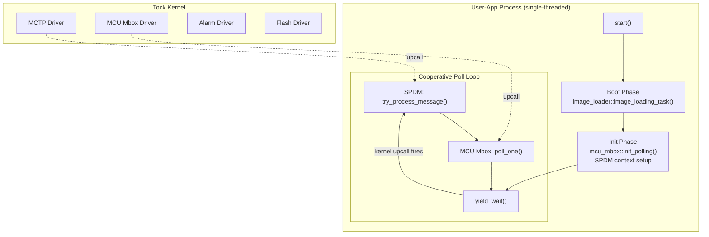

### Before vs. After: Execution Model

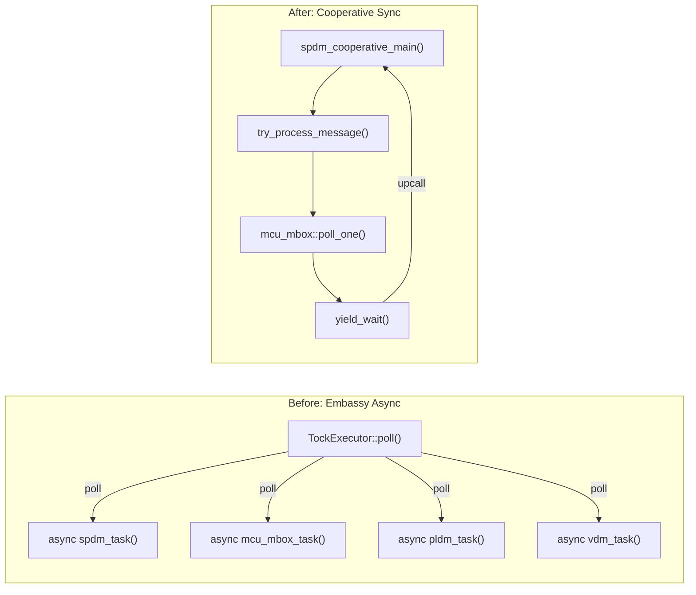

### Entry Point and Boot Sequence

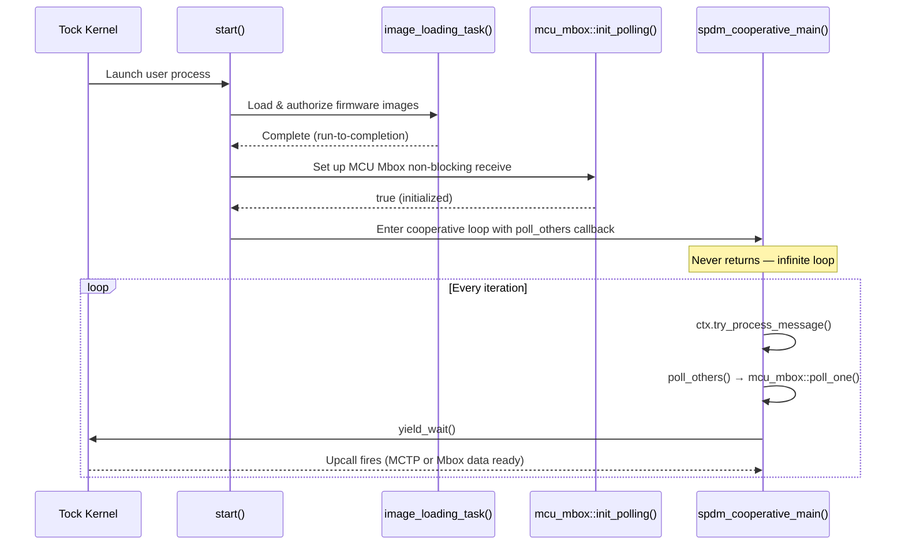

---

## Core Primitives

All synchronous primitives live in
`runtime/userspace/libtockasync/src/blocking.rs`. They rely on two
invariants of Tock userspace:

1. **Single-threaded** — only one thread of execution; no data races.
2. **Non-preemptive** — kernel upcalls only fire during `yield_wait()`
   or `yield_no_wait()`, never mid-instruction.

### `BlockingResult` — Stack-Based Syscall Completion

Replaces the heap-allocated `TockSubscribe` struct. A `Cell<Option<(u32,u32,u32)>>`
sits on the caller's stack. The kernel upcall writes directly to it.

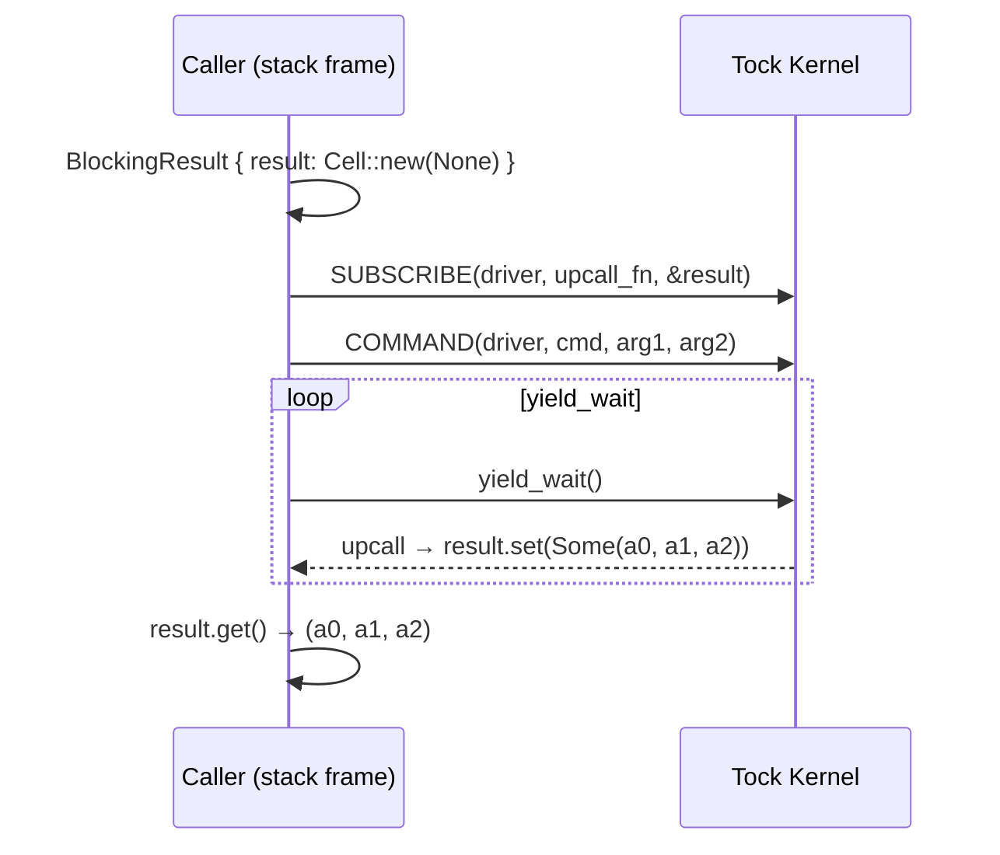

The helper functions compose this pattern with ALLOW syscalls:

| Function | Syscall Sequence |
|----------|-----------------|
| `subscribe_and_wait` | SUBSCRIBE → COMMAND → wait |
| `subscribe_allow_rw_and_wait` | ALLOW_RW → SUBSCRIBE → COMMAND → wait |
| `subscribe_allow_ro_and_wait` | ALLOW_RO → SUBSCRIBE → COMMAND → wait |
| `subscribe_allow_ro_rw_and_wait` | ALLOW_RO → ALLOW_RW → SUBSCRIBE → COMMAND → wait |

### `UpcallNotification` — Non-Blocking Event Flag

An atomic ready flag set by kernel upcalls, enabling cooperative polling
across multiple drivers without blocking in `yield_wait()` per driver.

```rust
pub struct UpcallNotification {
    ready: AtomicBool,                         // portable_atomic (no RMW on riscv32imc)
    args:  UnsafeCell<(u32, u32, u32)>,        // upcall arguments
}
```

```mermaid
stateDiagram-v2
    [*] --> Idle: new()
    Idle --> Armed: subscribe_notify() + COMMAND
    Armed --> Ready: kernel upcall sets ready=true, stores args
    Ready --> Processing: is_ready() returns true; caller reads args
    Processing --> Armed: clear() + arm_*() re-issues COMMAND
```

**Key methods:**

| Method | Purpose |
|--------|---------|
| `is_ready()` | Non-blocking check (`AtomicBool::load(Acquire)`) |
| `args()` | Read the `(u32, u32, u32)` upcall arguments |
| `clear()` | Reset `ready` to `false` |
| `wait<S>()` | Blocking spin: `yield_wait()` until `is_ready()` |

**Why `portable_atomic`:** The `riscv32imc` target lacks hardware atomic
RMW instructions. `core::sync::atomic::AtomicBool` is unavailable.
`portable_atomic` provides a software fallback using `load`/`store`
sequences, which is safe on single-threaded Tock.

### Synchronization Replacements

| Embassy Type | Replacement | Semantics |
|-------------|-------------|-----------|
| `Mutex<NoopRawMutex, T>` | `RefCell<T>` | Runtime borrow checking |
| `Mutex<CriticalSectionRawMutex, T>` | `CsMutex<T>` | Closure-based access: `.lock(\|&T\| ...)` |
| `Mutex<T>` (async) | `SyncMutex<T>` | Direct `&mut T` return (single-threaded only) |
| `LazyLock<T>` | `SyncLazy<T, F>` | First-access initialization |
| `Signal<..., ()>` | `AtomicBool` / `AtomicU8` | Polled flags |

> **Safety note:** `SyncMutex<T>` returns `&mut T` from `.lock()` without
> runtime borrow checking. It is sound only under Tock's single-threaded,
> non-preemptive model. All uses carry `// SAFETY:` comments documenting
> this invariant.

---

## Cooperative Poll Loop

The cooperative loop replaces Embassy's executor-driven task polling. SPDM
hosts the loop since it is always active; other services are polled via a
callback.

### Architecture

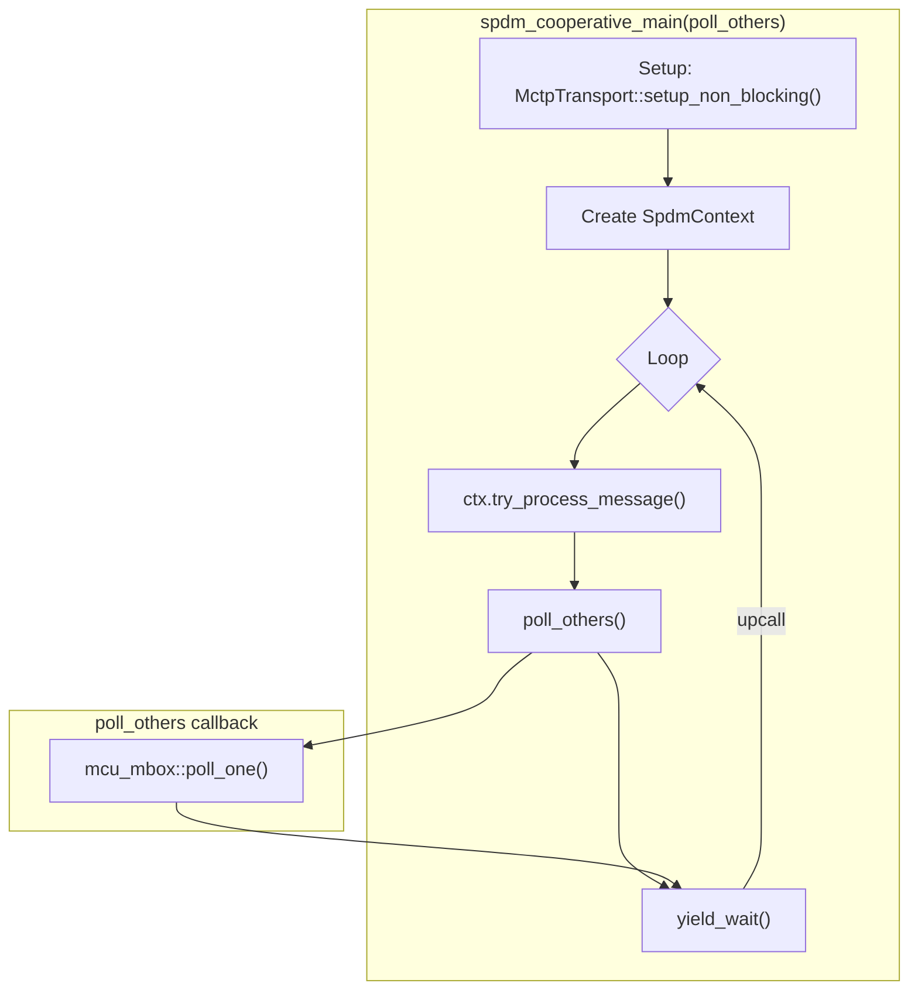

### Non-Blocking Transport Pattern

Every protocol transport implements the same three-method interface for
cooperative polling:

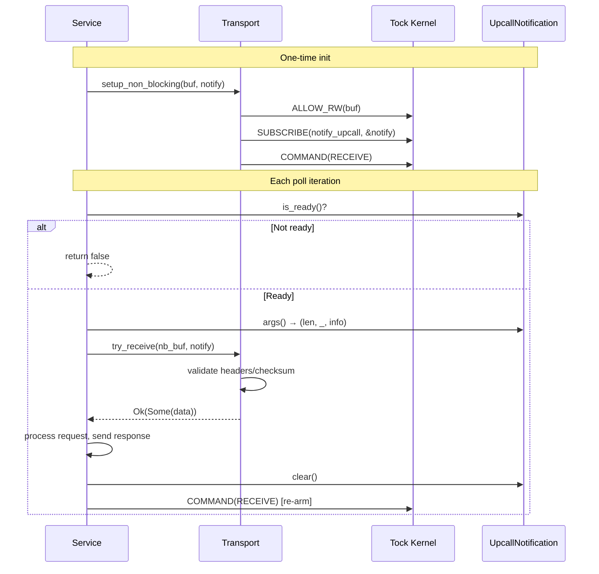

### Per-Protocol Transport API

| Protocol | Transport Type | `setup_non_blocking` | `try_receive_*` | `rearm` |
|----------|---------------|---------------------|-----------------|---------|
| **SPDM** | `MctpTransport` | Shares `MAX_SPDM_RESPONDER_BUF_SIZE` buffer | `receive_from_buffer()` on `SpdmTransport` trait | `rearm_receive()` on trait |
| **MCU Mbox** | `McuMboxTransport` | Shares `sizeof(McuMailboxReq)` buffer | `try_receive_request()` → validates checksum/header | `rearm()` → clear + arm |
| **PLDM** | `PldmTransport` (MCTP) | Shares MCTP-sized buffer | `try_receive_from_buffer()` → copies + validates MCTP header | `rearm()` |
| **VDM** | `VdmTransport` (MCTP) | Shares MCTP-sized buffer | `try_receive_from_buffer()` → copies + validates MCTP header | `rearm()` |

### SPDM: `try_process_message()`

The SPDM context wraps the transport pattern into a single call:

```rust
pub fn try_process_message(
    &mut self, msg_buf: &mut MessageBuf<'a>,
    nb_buf: &[u8], notify: &UpcallNotification,
) -> SpdmResult<bool> {
    if !notify.is_ready() { return Ok(false); }
    let args = notify.args();
    let secure = self.transport.receive_from_buffer(msg_buf, nb_buf, args)?;
    self.handle_received_message(msg_buf, secure)?;
    notify.clear();
    self.transport.rearm_receive()?;
    Ok(true)
}
```

`handle_received_message()` is shared with the blocking `process_message()`
path. It handles session decryption, request dispatch, and response
transmission.

### MCU Mbox: `poll_one()`

The MCU Mbox command interface combines check, process, and rearm:

```rust
pub fn poll_one(
    &mut self, nb_buf: &[u8], notify: &UpcallNotification, resp_buf: &mut [u8],
) -> bool {
    match self.transport.try_receive_request(nb_buf, notify) {
        Ok(Some((cmd_opcode, recv_len))) => {
            let _ = self.process_and_respond(cmd_opcode, &nb_buf[..recv_len], resp_buf);
            self.transport.rearm(notify);
            true
        }
        Ok(None) => false,
        Err(_) => {
            let _ = self.transport.finalize_response(MbxCmdStatus::Failure);
            self.transport.rearm(notify);
            false
        }
    }
}
```

### MCU Mbox: Static State Management

The MCU Mbox service splits initialization and polling across two functions.
State is stored in module-level statics since the kernel requires `'static`
buffers and the `CmdInterface` must persist across calls:

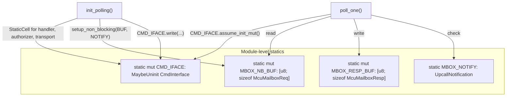

`StaticCell` ensures one-time initialization for the handler, authorizer,
and transport. `MaybeUninit` bridges the init/poll boundary without
requiring the type to implement `Default` or `const fn new()`.

> **Safety:** All `static mut` access is guarded by
> `#[allow(static_mut_refs)]` with `// SAFETY: single-threaded Tock
> userspace` comments. `init_polling()` must be called exactly once
> before `poll_one()`.

---

## PLDM Phase-Driven Service Loop

The original async PLDM architecture used Embassy `Signal` to coordinate
two tasks — a responder loop and an initiator (firmware download). The
synchronous replacement uses `run_until()`, a predicate-driven service loop.

### Problem: Signal-Based Coordination After Async Removal

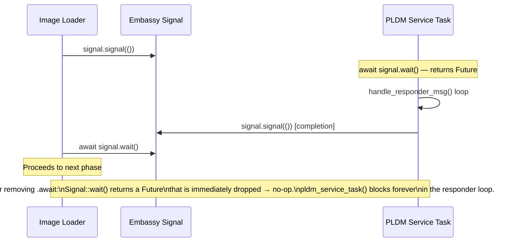

### Solution: `run_until()`

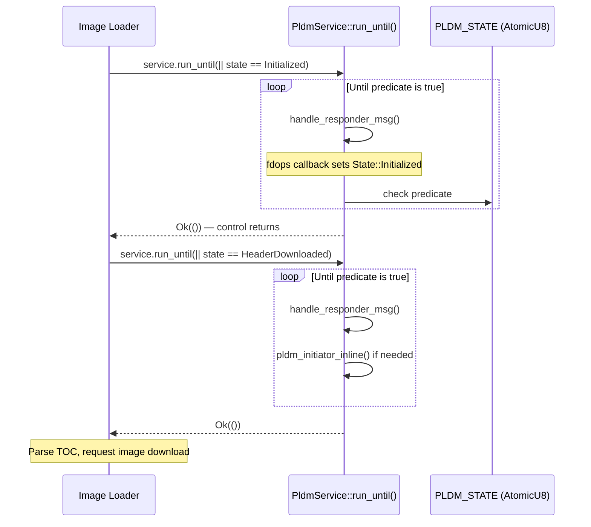

The caller drives the service phase-by-phase, checking shared state
between phases:

```rust
let mut service = pldm_client::initialize_pldm(fd_ops)?;
service.run_until(|| get_pldm_state() == State::Initialized)?;
let (offset, size) = pldm_client::pldm_download_toc(&mut service, component_id)?;
pldm_client::pldm_download_image(&mut service, load_address, offset, size)?;
```

The fdops callbacks (invoked from within the responder loop) set state
transitions in `PLDM_STATE`; no signaling needed — the `run_until`
predicate sees the change on the next iteration.

---

## Syscall Driver Interface

Each Tock syscall driver exposes both a blocking API (for simple
run-to-completion operations) and a non-blocking API (for cooperative
polling). The MCTP driver illustrates both:

### Blocking API

```rust
pub fn receive_request(&self, req: &mut [u8]) -> Result<(u32, MessageInfo), ErrorCode> {
    let (recv_len, _, info) = blocking::subscribe_allow_rw_and_wait::<S>(
        self.driver_num, subscribe::RECEIVED_REQUEST, allow_rw::READ_REQUEST,
        req, command::RECEIVE_REQUEST, 0, 0,
    )?;
    Ok((recv_len, info.into()))
}
```

This blocks in `yield_wait()` until data arrives — suitable for
single-service operation.

### Non-Blocking API

```rust
// One-time setup: share buffer + register notification + issue first COMMAND
pub fn setup_receive_request(
    &self, buf: &'static mut [u8], notify: &'static UpcallNotification,
) -> Result<(), ErrorCode> {
    blocking::do_allow_rw::<S>(self.driver_num, allow_rw::READ_REQUEST, buf)?;
    blocking::subscribe_notify::<S>(self.driver_num, subscribe::RECEIVED_REQUEST, notify)?;
    S::command(self.driver_num, command::RECEIVE_REQUEST, 0, 0)
        .to_result::<(), ErrorCode>()
}

// Re-arm after processing (buffer and upcall persist — only re-issue COMMAND)
pub fn arm_receive_request(&self) -> Result<(), ErrorCode> {
    S::command(self.driver_num, command::RECEIVE_REQUEST, 0, 0)
        .to_result::<(), ErrorCode>()
}
```

The setup shares a `'static` buffer with the kernel and registers an
`UpcallNotification` instead of a `BlockingResult`. When data arrives,
the kernel writes to the shared buffer and sets the notification's
`ready` flag. The application checks `is_ready()` in its poll loop
instead of blocking.

### Syscall Flow Comparison

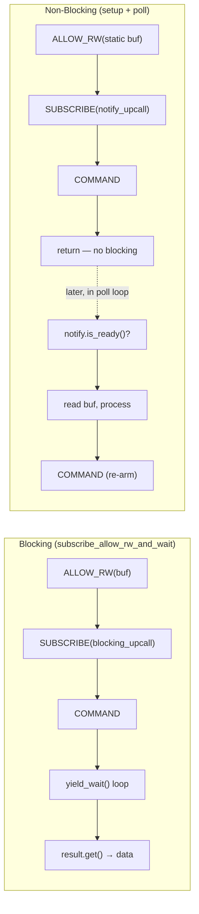

---

## Dependency Elimination

All Embassy runtime dependencies have been eliminated from the production
binary:

| Crate | Status |
|-------|--------|
| `embassy-executor` | Removed from all production crates. Retained behind optional `"executor"` feature in `libtockasync` for `example-app` only. |
| `embassy-sync` | Completely removed. |
| `async-trait` | Completely removed. |

### Replacement Type Map

| Embassy Type | Replacement | Location |
|-------------|-------------|----------|
| `blocking_mutex::Mutex<CriticalSectionRawMutex, T>` | `CsMutex<T>` | `pldm_context.rs`, `shared_large_msg_buf.rs` |
| `lazy_lock::LazyLock<T>` | `SyncLazy<T, F>` | `config.rs`, `pldm_fdops_mock.rs`, `firmware_update/mod.rs` |
| `Mutex<T>` (async, `NoopRawMutex`) | `RefCell<T>` | `fd_internal.rs` |
| `Mutex<T>` (async, `CriticalSectionRawMutex`) | `SyncMutex<T>` | `cert_chain/leaf.rs`, `device_cert_store.rs` |
| `Signal<..., ()>` | `AtomicBool` / `AtomicU8` | `daemon.rs`, `fips_periodic.rs` |
| `Spawner` | Direct function calls | 6 components (see below) |

### Spawner Elimination

The Embassy `Spawner` was threaded through many structs. All
`spawner.spawn(task_fn())` calls were replaced with direct `task_fn()`
calls:

| Component | Change |
|-----------|--------|
| `PldmService` | Removed `spawner` field; `start()` calls `pldm_service_loop()` directly |
| `McuMboxService` | Removed `spawner` field; `start()` calls `mcu_mbox_responder_task()` |
| `spawn_vdm_responder()` | Removed `Spawner` param; calls `vdm_responder_task()` directly |
| `FirmwareUpdater` | Removed `spawner` field |
| `PldmImageLoader` | Removed `spawner` field |
| `initialize_pldm()` | Removed `Spawner` param; calls `pldm_service_task()` directly |

### Entry Point

The original entry point used the Embassy executor:

```rust
// Before
pub fn start_async<S>(main: SpawnToken<S>) -> ! {
    let mut executor = TockExecutor::new();
    executor.run(|spawner| init(spawner, main));
}
```

The synchronous entry point calls `start()` directly:

```rust
// After
fn start() {
    async_main();  // direct call, no executor
}
```

The `TockExecutor` and `start_async` remain available behind the
`"executor"` Cargo feature for the standalone `example-app`.

---

## Design Considerations

### Concurrency Model

The cooperative poll loop achieves concurrent multi-service operation
without an async runtime. SPDM hosts the main loop and calls a
`poll_others` callback on each iteration:

```rust
spdm::spdm_cooperative_main(&mut || {
    if mbox_enabled { mcu_mbox::poll_one(); }
});
```

Each iteration:
1. SPDM checks its `UpcallNotification` and processes one message if ready
2. The callback checks MCU Mbox (and any other service)
3. `yield_wait()` suspends until the kernel fires any upcall

This is equivalent to Embassy's round-robin task polling but with zero
runtime overhead — no task queues, wakers, or vtable dispatch.

### `SyncMutex` Safety Invariant

`SyncMutex<T>` returns `&mut T` from `.lock()` without runtime borrow
checking. It is sound only under two invariants:

1. **Single-threaded** — Tock userspace runs one thread per process
2. **Non-preemptive** — kernel upcalls fire only during explicit yield
   calls, never interrupting user code mid-function

If either invariant changes (multi-threaded Tock, signal-like preemption),
every `SyncMutex` usage becomes unsound. All uses carry `// SAFETY:`
comments documenting these requirements.

### PLDM Initiator/Responder Interleaving

The original Embassy design ran the PLDM responder and initiator as
separate async tasks polled independently. The synchronous `run_until()`
handles one responder message per iteration, then runs the initiator
inline if needed. The initiator's download loop blocks further responder
processing until it yields via `sleep_ticks()`. This is acceptable
because the PLDM download protocol is lock-step (request-response), but
it is a behavioral difference from the async version.

### `riscv32imc` Atomic Constraints

The target lacks hardware atomic read-modify-write instructions.
`core::sync::atomic::AtomicBool` is unavailable. The codebase uses
`portable_atomic::AtomicBool` which provides software-emulated atomics.
Only `load()` and `store()` are used — `swap()` and `compare_exchange()`
are avoided since they require RMW and would panic. This is safe because
the system is single-threaded and non-preemptive.

### Static Buffer Sharing

The Tock kernel requires `&'static mut [u8]` for shared buffers (via
`ALLOW_RW`). The non-blocking transport methods use `static mut` arrays
for kernel-shared receive buffers:

```rust
static mut SPDM_NB_BUF: [u8; MAX_SPDM_RESPONDER_BUF_SIZE] =
    [0; MAX_SPDM_RESPONDER_BUF_SIZE];

// Setup: kernel gets &'static mut to write into
let nb_buf: &'static mut [u8] = unsafe { &mut SPDM_NB_BUF };
transport.setup_non_blocking(nb_buf, &NOTIFY)?;

// Poll: app reads from the same buffer (kernel only writes during upcall)
let nb_ref: &[u8] = unsafe { &SPDM_NB_BUF };
ctx.try_process_message(&mut msg_buf, nb_ref, &NOTIFY)?;
```

This is sound because the kernel writes to the buffer only when it fires
the upcall (during `yield_wait()`), and the application reads the buffer
only after `is_ready()` returns true and before calling `rearm()`.

### Why Async Was Expensive on This Target

The original architecture imposed significant binary costs for zero benefit
on a single-threaded MCU:

1. **Async state machines** — Every `async fn` compiles to an enum state
   machine. Each `.await` point adds a variant. With dozens of async functions
   chained together, these enums grow large and deeply nested.

2. **Heap-allocated futures** — `TockSubscribe::subscribe()` returned a
   `Pin<Box<TockSubscribe>>`. Every syscall driver operation paid for a heap
   allocation, vtable pointer, and `Drop` glue.

3. **Embassy executor** — `TockExecutor` and the `Spawner` infrastructure
   pulled in task-queue management, waker registration, and polling loops — all
   unnecessary on a single-threaded system that can simply `yield_wait()`.

4. **`async_trait` boxing** — Trait methods marked `#[async_trait]` required
   `Box<dyn Future>` return types, adding allocation and dynamic dispatch.

5. **`embassy_sync` overhead** — `Mutex::lock()` returned a Future;
   `Signal::wait()` was async. On a single-threaded system, an `UnsafeCell`
   and an `AtomicBool` achieve the same semantics at zero cost.

---

## File Reference

| File | Purpose |
|------|---------|
| `runtime/userspace/libtockasync/src/blocking.rs` | All synchronous primitives: `BlockingResult`, `SyncMutex`, `CsMutex`, `SyncLazy`, `UpcallNotification` |
| `runtime/userspace/libtockasync/src/lib.rs` | Entry point; `NullCriticalSection`; optional Embassy executor |
| `runtime/userspace/syscall/src/mctp.rs` | MCTP driver: blocking + non-blocking APIs |
| `runtime/userspace/syscall/src/mcu_mbox.rs` | MCU Mbox driver: blocking + non-blocking APIs |
| `runtime/userspace/api/spdm-lib/src/context.rs` | `try_process_message()`, `handle_received_message()` |
| `runtime/userspace/api/spdm-lib/src/transport/mctp.rs` | `setup_non_blocking()`, `receive_from_buffer()`, `rearm_receive()` |
| `runtime/userspace/api/spdm-lib/src/transport/common.rs` | `SpdmTransport` trait with default non-blocking methods |
| `runtime/userspace/api/mcu-mbox-lib/src/transport.rs` | `setup_non_blocking()`, `try_receive_request()`, `rearm()` |
| `runtime/userspace/api/mcu-mbox-lib/src/cmd_interface.rs` | `poll_one()`, `process_and_respond()` |
| `runtime/userspace/api/pldm-lib/src/daemon.rs` | `PldmService::run_until()` |
| `runtime/userspace/api/pldm-lib/src/transport.rs` | PLDM transport: blocking + non-blocking APIs |
| `runtime/userspace/api/mctp-vdm-lib/src/transport.rs` | VDM transport: blocking + non-blocking APIs |
| `platforms/emulator/runtime/userspace/apps/user/src/main.rs` | `async_main()` entry point |
| `platforms/emulator/runtime/userspace/apps/user/src/spdm/mod.rs` | `spdm_cooperative_main()` |
| `platforms/emulator/runtime/userspace/apps/user/src/mcu_mbox/mod.rs` | `init_polling()`, `poll_one()` |
